# FieldForce Pro - Architecture Documentation

Comprehensive technical documentation of the FieldForce Pro application architecture, including interactive diagrams, component relationships, and data flow patterns.

---

## Table of Contents

- [High-Level Architecture](#high-level-architecture)
- [System Architecture Diagram](#system-architecture-diagram)
- [Folder Structure](#folder-structure)
- [Component Architecture](#component-architecture)
- [Routing Architecture](#routing-architecture)
- [Data Flow Patterns](#data-flow-patterns)
- [Design System](#design-system)
- [Module Interactions](#module-interactions)
- [State Management](#state-management)
- [Build & Deployment](#build--deployment)

---

## High-Level Architecture

FieldForce Pro is built as a modern single-page application (SPA) using React with TypeScript. The architecture follows a component-based design pattern with clear separation of concerns.

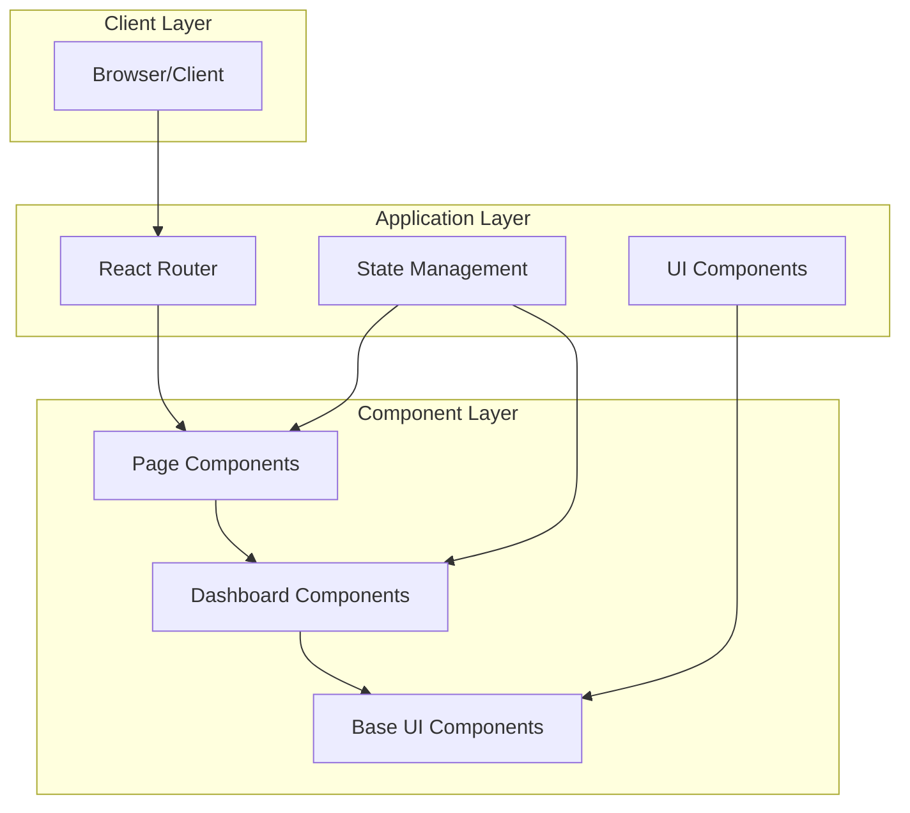

---

## System Architecture Diagram

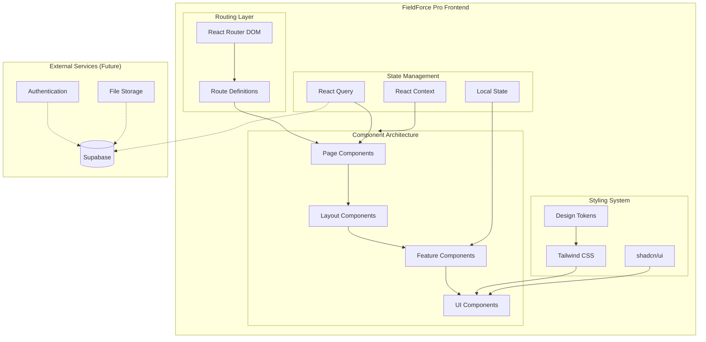

---

## Folder Structure

```
fieldforce-pro/
├── public/                     # Static assets
│   ├── favicon.ico
│   ├── placeholder.svg
│   └── robots.txt
│
├── src/
│   ├── assets/                 # Project assets (images, fonts)
│   │
│   ├── components/
│   │   ├── dashboard/          # Dashboard-specific components
│   │   │   ├── AIInsightsPanel.tsx
│   │   │   ├── ChurnRiskTable.tsx
│   │   │   ├── DashboardFooter.tsx
│   │   │   ├── DashboardHeader.tsx
│   │   │   ├── DashboardLayout.tsx
│   │   │   ├── DashboardSidebar.tsx
│   │   │   ├── ExportButton.tsx
│   │   │   ├── FilterPanel.tsx
│   │   │   ├── HorizontalFilterPanel.tsx
│   │   │   ├── JobMetrics.tsx
│   │   │   ├── JobRiskHeatmap.tsx
│   │   │   ├── KPICard.tsx
│   │   │   ├── RevenueChart.tsx
│   │   │   ├── RevenueForecastChart.tsx
│   │   │   ├── TechnicianBurnoutWarnings.tsx
│   │   │   ├── TechnicianMap.tsx
│   │   │   └── WAIVEChatbot.tsx
│   │   │
│   │   └── ui/                 # Base UI components (shadcn/ui)
│   │       ├── accordion.tsx
│   │       ├── alert.tsx
│   │       ├── badge.tsx
│   │       ├── button.tsx
│   │       ├── card.tsx
│   │       ├── chart.tsx
│   │       └── ... (40+ components)
│   │
│   ├── hooks/                  # Custom React hooks
│   │   ├── use-mobile.tsx
│   │   └── use-toast.ts
│   │
│   ├── lib/                    # Utility functions
│   │   └── utils.ts
│   │
│   ├── pages/                  # Page components (routes)
│   │   ├── Analytics.tsx
│   │   ├── ComingSoon.tsx
│   │   ├── Customers.tsx
│   │   ├── Dashboard.tsx
│   │   ├── FieldOperations.tsx
│   │   ├── Fleet.tsx
│   │   ├── Index.tsx
│   │   ├── Marketing.tsx
│   │   ├── NotFound.tsx
│   │   ├── PredictiveInsights.tsx
│   │   └── ... more pages
│   │
│   ├── App.tsx                 # Root application component
│   ├── App.css                 # Application styles
│   ├── index.css               # Global styles & design tokens
│   ├── main.tsx                # Application entry point
│   └── vite-env.d.ts           # Vite type definitions
│
├── eslint.config.js            # ESLint configuration
├── index.html                  # HTML entry point
├── tailwind.config.ts          # Tailwind CSS configuration
├── tsconfig.json               # TypeScript configuration
├── vite.config.ts              # Vite build configuration
├── README.md                   # Project documentation
├── API.md                      # API reference
└── ARCHITECTURE.md             # This file
```

---

## Component Architecture

### Component Hierarchy

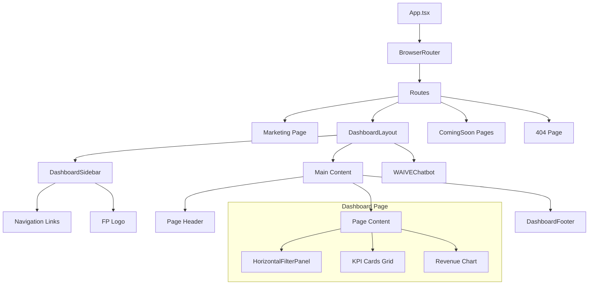

### Component Types

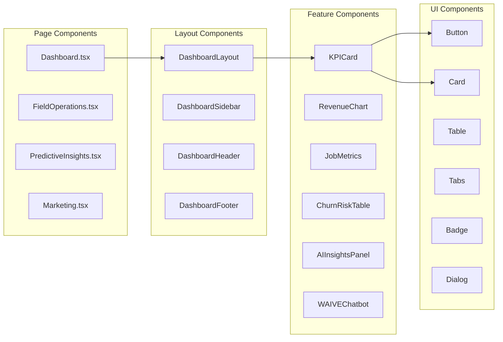

### Component Relationships

| Type | Location | Purpose | Examples |
|------|----------|---------|----------|
| Page Components | `src/pages/` | Route-level containers | Dashboard, FieldOperations, Marketing |
| Layout Components | `src/components/dashboard/` | Structural wrappers | DashboardLayout, DashboardSidebar |
| Feature Components | `src/components/dashboard/` | Business logic & visualization | KPICard, RevenueChart, ChurnRiskTable |
| UI Components | `src/components/ui/` | Reusable primitives | Button, Card, Input, Dialog |

---

## Routing Architecture

### Route Configuration

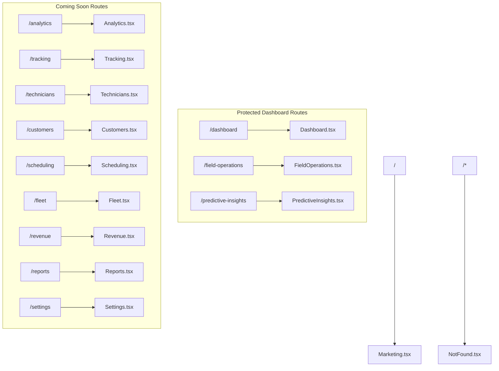

### Navigation Flow

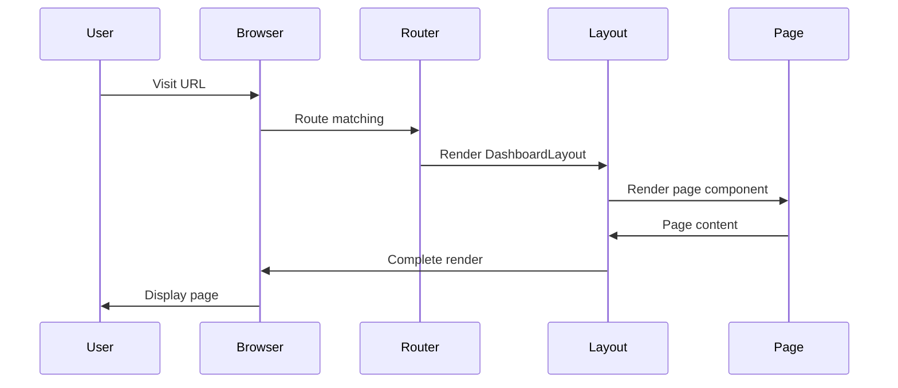

---

## Data Flow Patterns

### Current Architecture (Static Data)

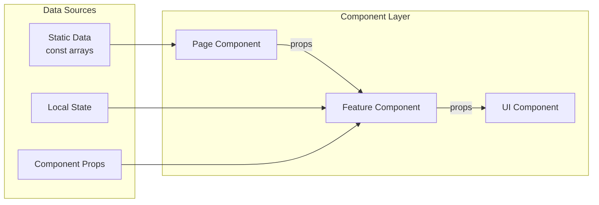

### Filter Data Flow

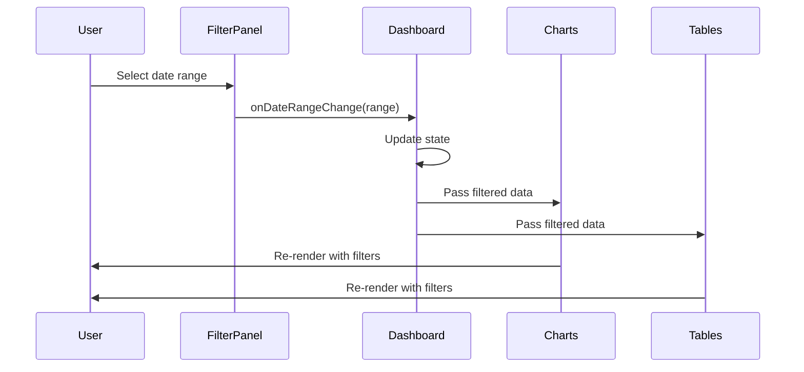

### Future Architecture (With Backend)

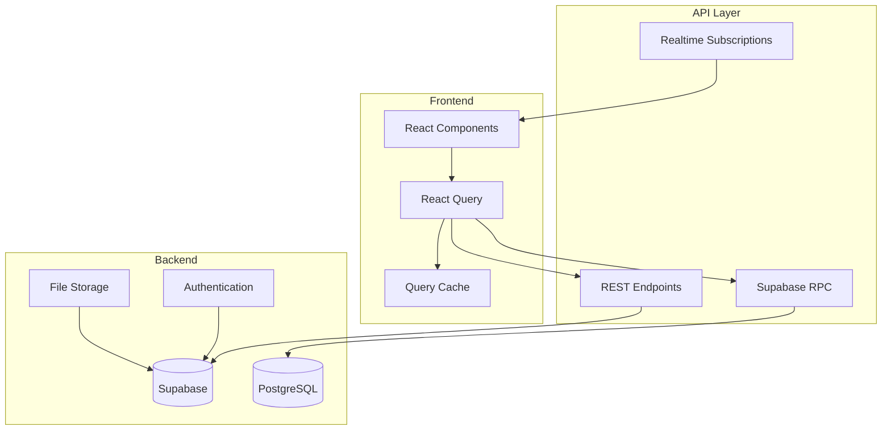

---

## Design System

### Color Token System

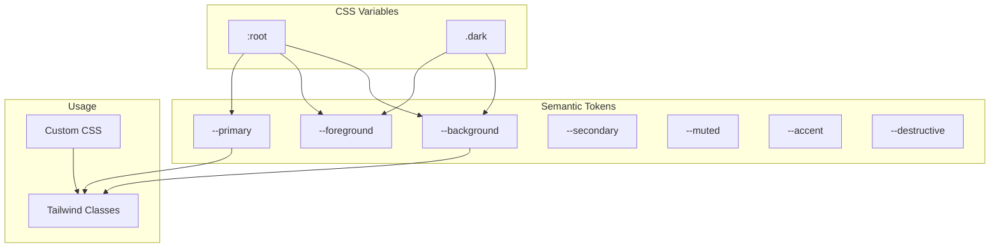

### Color Token Values

```css
/* Light Theme */
:root {
  --background: 0 0% 100%;
  --foreground: 222.2 84% 4.9%;
  --card: 0 0% 100%;
  --primary: 222.2 47.4% 11.2%;
  --secondary: 210 40% 96%;
  --muted: 210 40% 96%;
  --accent: 210 40% 96%;
  --destructive: 0 84.2% 60.2%;
  --success: 142.1 76.2% 36.3%;
  --warning: 45.4 93.4% 47.5%;
}

/* Dark Theme */
.dark {
  --background: 222.2 84% 4.9%;
  --foreground: 210 40% 98%;
  /* ... */
}
```

### Component Variant System

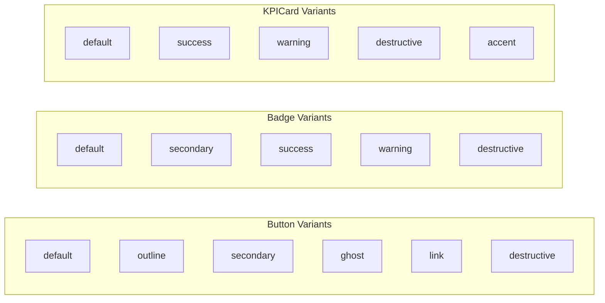

---

## Module Interactions

### Dashboard Module Interaction

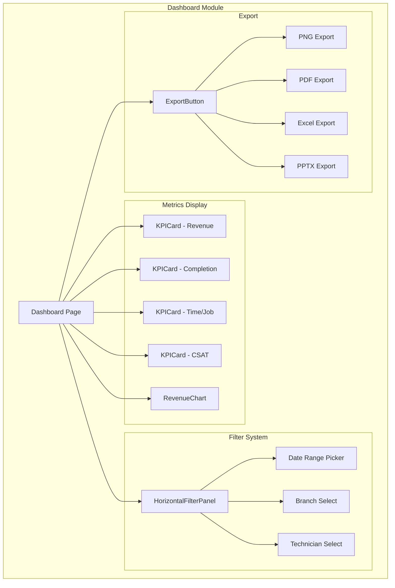

### Predictive Insights Module

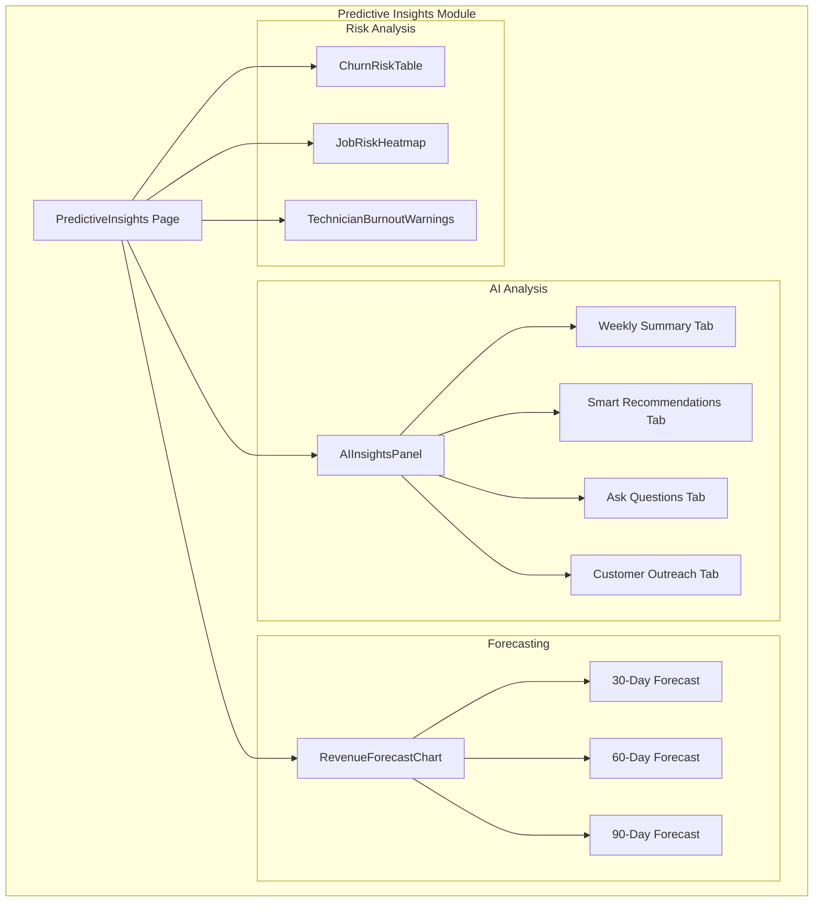

### WAIVE Chatbot Interaction Flow

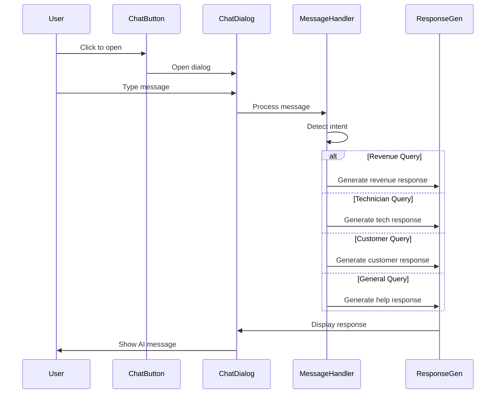

---

## State Management

### State Architecture

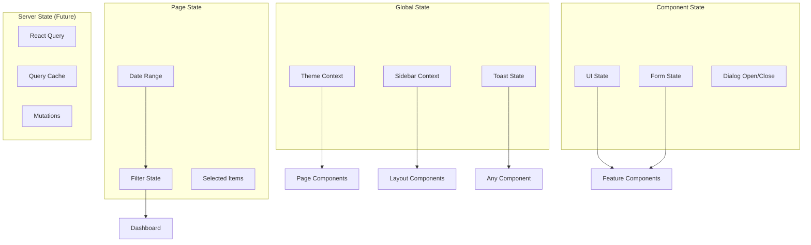

### State Flow Pattern

```typescript
// Page-level state management
function Dashboard() {
  // Filter state
  const [dateRange, setDateRange] = useState<DateRange>();
  const [selectedBranch, setSelectedBranch] = useState<string>();
  
  // Computed/filtered data
  const filteredData = useMemo(() => {
    return data.filter(/* filter logic */);
  }, [data, dateRange, selectedBranch]);
  
  return (
    <HorizontalFilterPanel 
      onDateRangeChange={setDateRange}
      onBranchChange={setSelectedBranch}
    />
    <KPICards data={filteredData} />
    <Charts data={filteredData} />
  );
}
```

---

## Build & Deployment

### Build Pipeline

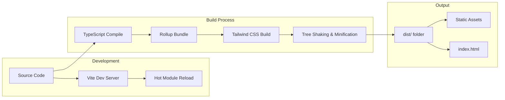

### Build Commands

```bash
# Development server
npm run dev

# Production build
npm run build

# Preview production build
npm run preview

# Type checking
npm run typecheck

# Linting
npm run lint
```

### Environment Configuration

```typescript
// vite.config.ts
export default defineConfig({
  plugins: [react()],
  resolve: {
    alias: {
      "@": path.resolve(__dirname, "./src"),
    },
  },
  server: {
    host: "::",
    port: 8080,
  },
});
```

---

## Performance Considerations

### Code Splitting Strategy

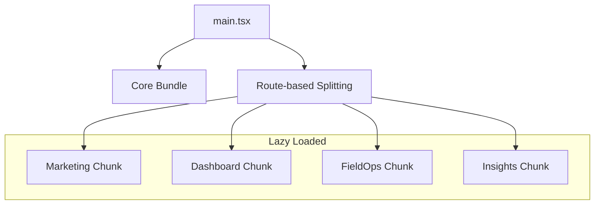

### Optimization Techniques

1. **Component Lazy Loading**
   ```typescript
   const Dashboard = lazy(() => import('./pages/Dashboard'));
   ```

2. **Memoization**
   ```typescript
   const filteredData = useMemo(() => /* ... */, [deps]);
   const handleClick = useCallback(() => /* ... */, [deps]);
   ```

3. **Virtual Scrolling** (for large lists)
4. **Image Optimization** (lazy loading, proper sizing)

---

## Security Architecture

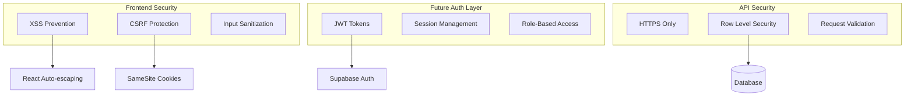

---

*FieldForce Pro Architecture Documentation v1.0*

*Designed and developed by Pulkit Chaudhary*
