# System Design Document (SDD)
## Modern Analytics Platform
### Fivetran → Snowflake → dbt → Sigma Computing

**Document Version:** 1.0  
**Last Updated:** January 2026  
**Status:** Production-Ready Design

---

## Table of Contents

1. [Executive Summary](#executive-summary)
2. [Goals, Non-Goals & Assumptions](#goals-non-goals--assumptions)
3. [High-Level Architecture](#high-level-architecture)
4. [Snowflake Design](#snowflake-design)
5. [Fivetran Design](#fivetran-design)
6. [dbt Design](#dbt-design)
7. [Sigma Design](#sigma-design)
8. [Security & Governance](#security--governance)
9. [Reliability & Operations](#reliability--operations)
10. [Data Quality](#data-quality)
11. [Performance & Scalability](#performance--scalability)
12. [Risks & Mitigations](#risks--mitigations)
13. [Implementation Plan](#implementation-plan)
14. [Design Rationale & Tradeoffs](#design-rationale-and-tradeoffs)

---

## Executive Summary

This document outlines the system design for a production-grade analytics platform serving FieldForce Pro's business intelligence needs. The platform ingests data from operational systems, transforms it through a medallion architecture, and exposes governed datasets for self-service analytics.

**Key Components:**
- **Fivetran**: Managed ELT for reliable data ingestion
- **Snowflake**: Cloud data warehouse with consumption-based pricing
- **dbt**: SQL-first transformation layer with version control
- **Sigma**: Spreadsheet-like BI for business users

---

## Goals, Non-Goals & Assumptions

### Goals

| Priority | Goal | Success Metric |
|----------|------|----------------|
| P0 | Reliable daily data refresh for all operational sources | 99.5% SLA on data freshness |
| P0 | Self-service analytics for business users | <5 min average query time |
| P1 | Single source of truth for key business metrics | 100% metric consistency across reports |
| P1 | Governed data access with audit trails | Zero unauthorized data access incidents |
| P2 | Sub-10 minute latency for critical dashboards | P95 dashboard load <10s |
| P2 | Cost-efficient compute utilization | <$15K/month infrastructure cost |

### Non-Goals

- **Real-time streaming analytics** - Current business needs are met with batch processing (15-min minimum latency acceptable)
- **Machine Learning model serving** - ML workloads will use a separate platform (Databricks/SageMaker)
- **Data science notebooks** - Sigma serves BI; data science uses separate tooling
- **Multi-cloud deployment** - Single cloud (AWS) for Snowflake region
- **Custom ETL pipelines** - Fivetran handles all ingestion; no custom scripts

### Assumptions

#### Data Sources
| Source | Type | Volume | Refresh Cadence |
|--------|------|--------|-----------------|
| PostgreSQL (Jobs DB) | OLTP | 50GB, 10M rows | Every 15 minutes |
| Salesforce CRM | SaaS | 5GB, 500K records | Every 1 hour |
| QuickBooks (Invoicing) | SaaS | 2GB, 200K records | Every 6 hours |
| Google Sheets (Manual) | File | 10MB, 5K rows | Every 24 hours |
| ServiceTitan API | REST | 20GB, 2M records | Every 30 minutes |
| GPS/Telematics | IoT | 100GB, 50M events/day | Every 1 hour |

#### User Personas & Access Patterns
| Persona | Count | Primary Use Case | Concurrency |
|---------|-------|------------------|-------------|
| Executives | 5 | Strategic dashboards | Low (2-3) |
| Office Managers | 15 | Operational reports | Medium (5-10) |
| Field Supervisors | 25 | Mobile drill-downs | High (15-20) |
| Analysts | 8 | Ad-hoc exploration | Medium (3-5) |

#### Technical Assumptions
- Snowflake region: `AWS US-EAST-1`
- All timestamps stored in UTC
- Data retention: 7 years for financial, 2 years for operational
- Peak usage: 8 AM - 6 PM EST weekdays

---

## High-Level Architecture

### End-to-End Data Flow Diagram

```mermaid
flowchart TB
    subgraph Sources["📊 Data Sources"]
        PG[(PostgreSQL<br/>Jobs DB)]
        SF[☁️ Salesforce]
        QB[💰 QuickBooks]
        ST[🔧 ServiceTitan]
        GPS[📍 GPS/Telematics]
        GS[📋 Google Sheets]
    end

    subgraph Fivetran["🔄 Fivetran (ELT Ingestion)"]
        direction TB
        FT_CONN[Connectors]
        FT_SYNC[Sync Engine]
        FT_LOG[Sync Logs]
        FT_CONN --> FT_SYNC
        FT_SYNC --> FT_LOG
    end

    subgraph Snowflake["❄️ Snowflake Data Warehouse"]
        subgraph RAW["🔴 RAW Layer"]
            RAW_DB[(ANALYTICS_RAW)]
            RAW_JOBS[fivetran_jobs.*]
            RAW_CRM[fivetran_salesforce.*]
            RAW_FIN[fivetran_quickbooks.*]
        end

        subgraph STG["🟡 STAGING Layer"]
            STG_DB[(ANALYTICS_STAGING)]
            STG_JOBS[stg_jobs.*]
            STG_CRM[stg_customers.*]
            STG_FIN[stg_invoices.*]
        end

        subgraph INT["🟠 INTERMEDIATE Layer"]
            INT_DB[(ANALYTICS_INTERMEDIATE)]
            INT_JOB_CUST[int_jobs_customers]
            INT_TECH_PERF[int_technician_performance]
            INT_REV[int_revenue_daily]
        end

        subgraph MARTS["🟢 MARTS Layer"]
            MARTS_DB[(ANALYTICS_MARTS)]
            DIM_CUST[dim_customers]
            DIM_TECH[dim_technicians]
            DIM_SVC[dim_services]
            FCT_JOBS[fct_jobs]
            FCT_REV[fct_revenue]
            RPT_EXEC[rpt_executive_summary]
            RPT_OPS[rpt_operations_daily]
        end

        subgraph WH["⚙️ Warehouses"]
            WH_INGEST[INGEST_WH<br/>X-Small]
            WH_TRANSFORM[TRANSFORM_WH<br/>Small]
            WH_BI[BI_WH<br/>Medium]
            WH_ADHOC[ADHOC_WH<br/>Small]
        end
    end

    subgraph DBT["🔧 dbt (Transformations)"]
        direction TB
        DBT_SRC[Source Tests]
        DBT_STG[Staging Models]
        DBT_INT[Intermediate Models]
        DBT_MARTS[Mart Models]
        DBT_TESTS[Data Tests]
        DBT_DOCS[Documentation]
        
        DBT_SRC --> DBT_STG --> DBT_INT --> DBT_MARTS
        DBT_MARTS --> DBT_TESTS
        DBT_MARTS --> DBT_DOCS
    end

    subgraph Sigma["📈 Sigma Computing (BI)"]
        direction TB
        SIG_CONN[Connection<br/>BI_WH Role]
        SIG_DS[Certified Datasets]
        SIG_WB[Workbooks]
        SIG_DASH[Dashboards]
        SIG_EMBED[Embedded Analytics]
        
        SIG_CONN --> SIG_DS
        SIG_DS --> SIG_WB
        SIG_WB --> SIG_DASH
        SIG_DASH --> SIG_EMBED
    end

    subgraph Users["👥 End Users"]
        EXEC[📊 Executives]
        MGR[📋 Managers]
        FIELD[🚐 Field Supervisors]
        ANALYST[🔍 Analysts]
    end

    %% Flow connections
    PG & SF & QB & ST & GPS & GS --> Fivetran
    Fivetran -->|"Lands in RAW"| RAW
    RAW -->|"dbt reads"| DBT
    DBT -->|"Writes to"| STG & INT & MARTS
    MARTS -->|"Sigma queries"| Sigma
    Sigma --> Users

    %% Warehouse assignments
    WH_INGEST -.->|"Fivetran uses"| RAW
    WH_TRANSFORM -.->|"dbt uses"| STG & INT & MARTS
    WH_BI -.->|"Sigma uses"| Sigma
    WH_ADHOC -.->|"Analysts use"| ANALYST

    style RAW fill:#ffcccc,stroke:#cc0000
    style STG fill:#fff3cc,stroke:#cc9900
    style INT fill:#ffe6cc,stroke:#cc6600
    style MARTS fill:#ccffcc,stroke:#00cc00
    style Fivetran fill:#e6f3ff,stroke:#0066cc
    style DBT fill:#f0e6ff,stroke:#6600cc
    style Sigma fill:#e6ffe6,stroke:#006600
```



### Data Modeling & Environments Diagram


### Component Responsibilities

| Component | Primary Responsibility | Secondary Responsibilities |
|-----------|----------------------|---------------------------|
| **Fivetran** | Data ingestion from sources | Schema change detection, sync monitoring |
| **Snowflake** | Data storage & compute | Access control, query optimization |
| **dbt** | Data transformation | Testing, documentation, lineage |
| **Sigma** | Business intelligence | Self-service analytics, governance |

---

## Snowflake Design

### Database & Schema Naming Conventions

```
┌─────────────────────────────────────────────────────────────────┐
│                    NAMING CONVENTION                             │
├─────────────────────────────────────────────────────────────────┤
│ Database:  {PROJECT}_{LAYER}                                     │
│ Schema:    {source_system} (raw) or {domain} (marts)            │
│ Table:     {prefix}_{entity}_{suffix}                           │
│                                                                  │
│ Prefixes:  raw_, stg_, int_, dim_, fct_, rpt_, snap_            │
│ Suffixes:  _daily, _monthly, _snapshot, _scd2                   │
└─────────────────────────────────────────────────────────────────┘
```

#### Database Structure

| Database | Purpose | Schemas |
|----------|---------|---------|
| `ANALYTICS_RAW` | Landing zone for Fivetran | `fivetran_postgres`, `fivetran_salesforce`, `fivetran_quickbooks`, `fivetran_servicetitan` |
| `ANALYTICS_STAGING` | Cleaned, typed, deduplicated | `stg_jobs`, `stg_customers`, `stg_finance`, `stg_technicians` |
| `ANALYTICS_INTERMEDIATE` | Business logic joins | `int_operations`, `int_finance`, `int_hr` |
| `ANALYTICS_MARTS` | Consumption layer | `core`, `finance`, `operations`, `executive` |
| `ANALYTICS_DEV` | Developer sandboxes | `dev_{username}_*` |
| `ANALYTICS_STAGING_ENV` | Pre-production testing | Mirrors production structure |

### Compute Warehouse Strategy

```sql
-- WAREHOUSE CONFIGURATION

-- Ingestion Warehouse (Fivetran)
CREATE WAREHOUSE INGEST_WH WITH
    WAREHOUSE_SIZE = 'X-SMALL'
    AUTO_SUSPEND = 60            -- 1 minute
    AUTO_RESUME = TRUE
    MIN_CLUSTER_COUNT = 1
    MAX_CLUSTER_COUNT = 1
    INITIALLY_SUSPENDED = TRUE
    COMMENT = 'Fivetran data ingestion - cost optimized';

-- Transformation Warehouse (dbt)
CREATE WAREHOUSE TRANSFORM_WH WITH
    WAREHOUSE_SIZE = 'SMALL'
    AUTO_SUSPEND = 120           -- 2 minutes
    AUTO_RESUME = TRUE
    MIN_CLUSTER_COUNT = 1
    MAX_CLUSTER_COUNT = 2        -- Scale for full refreshes
    SCALING_POLICY = 'ECONOMY'
    INITIALLY_SUSPENDED = TRUE
    COMMENT = 'dbt transformations - scheduled workloads';

-- BI Warehouse (Sigma)
CREATE WAREHOUSE BI_WH WITH
    WAREHOUSE_SIZE = 'MEDIUM'
    AUTO_SUSPEND = 300           -- 5 minutes (dashboard caching)
    AUTO_RESUME = TRUE
    MIN_CLUSTER_COUNT = 1
    MAX_CLUSTER_COUNT = 4        -- Scale for concurrent users
    SCALING_POLICY = 'STANDARD'
    INITIALLY_SUSPENDED = TRUE
    COMMENT = 'Sigma dashboards - user-facing queries';

-- Ad-hoc Warehouse (Analysts)
CREATE WAREHOUSE ADHOC_WH WITH
    WAREHOUSE_SIZE = 'SMALL'
    AUTO_SUSPEND = 60
    AUTO_RESUME = TRUE
    MIN_CLUSTER_COUNT = 1
    MAX_CLUSTER_COUNT = 2
    STATEMENT_TIMEOUT_IN_SECONDS = 900  -- 15 min query timeout
    COMMENT = 'Analyst exploration - controlled cost';
```

### Layering Approach (Medallion Architecture)

#### Layer Specifications

| Layer | Database | Materialization | Retention | Purpose |
|-------|----------|-----------------|-----------|---------|
| **Raw/Landing** | `ANALYTICS_RAW` | Tables (Fivetran managed) | 90 days + Time Travel | Exact source replica |
| **Staging** | `ANALYTICS_STAGING` | Views (ephemeral) | N/A | Rename, cast, dedupe |
| **Intermediate** | `ANALYTICS_INTERMEDIATE` | Tables | 30 days | Complex joins, business logic |
| **Marts** | `ANALYTICS_MARTS` | Tables + Incremental | 7 years | Star schema, metrics |

#### Schema Design Example

```sql
-- RAW LAYER (Fivetran lands here)
ANALYTICS_RAW.FIVETRAN_POSTGRES.JOBS
ANALYTICS_RAW.FIVETRAN_POSTGRES.TECHNICIANS
ANALYTICS_RAW.FIVETRAN_POSTGRES.CUSTOMERS
ANALYTICS_RAW.FIVETRAN_SALESFORCE.ACCOUNTS
ANALYTICS_RAW.FIVETRAN_SALESFORCE.OPPORTUNITIES

-- STAGING LAYER (dbt views)
ANALYTICS_STAGING.STG_JOBS.STG_JOBS
ANALYTICS_STAGING.STG_CUSTOMERS.STG_CUSTOMERS
ANALYTICS_STAGING.STG_TECHNICIANS.STG_TECHNICIANS

-- INTERMEDIATE LAYER (dbt tables)
ANALYTICS_INTERMEDIATE.INT_OPERATIONS.INT_JOBS_ENRICHED
ANALYTICS_INTERMEDIATE.INT_OPERATIONS.INT_TECHNICIAN_DAILY_METRICS
ANALYTICS_INTERMEDIATE.INT_FINANCE.INT_REVENUE_BY_SERVICE

-- MARTS LAYER (dbt tables - star schema)
ANALYTICS_MARTS.CORE.DIM_CUSTOMERS
ANALYTICS_MARTS.CORE.DIM_TECHNICIANS
ANALYTICS_MARTS.CORE.DIM_SERVICES
ANALYTICS_MARTS.CORE.DIM_DATE
ANALYTICS_MARTS.CORE.FCT_JOBS
ANALYTICS_MARTS.FINANCE.FCT_REVENUE
ANALYTICS_MARTS.OPERATIONS.FCT_TECHNICIAN_PERFORMANCE
ANALYTICS_MARTS.EXECUTIVE.RPT_EXECUTIVE_SUMMARY
```

### Clustering & Partitioning

```sql
-- CLUSTERING STRATEGY

-- Fact tables: Cluster on date + high-cardinality dimension
ALTER TABLE ANALYTICS_MARTS.CORE.FCT_JOBS
    CLUSTER BY (job_completed_date, customer_id);

ALTER TABLE ANALYTICS_MARTS.FINANCE.FCT_REVENUE
    CLUSTER BY (revenue_date, service_type_id);

-- Large dimension tables: Cluster on join key
ALTER TABLE ANALYTICS_MARTS.CORE.DIM_CUSTOMERS
    CLUSTER BY (customer_id);

-- Time-series data: Cluster on timestamp
ALTER TABLE ANALYTICS_INTERMEDIATE.INT_OPERATIONS.INT_GPS_EVENTS
    CLUSTER BY (TO_DATE(event_timestamp), technician_id);
```

**Clustering Guidelines:**
- Apply only to tables > 1TB or with frequent range queries
- Maximum 4 clustering keys
- Place most-filtered column first
- Monitor with `SYSTEM$CLUSTERING_INFORMATION()`

### Cost Controls

```sql
-- RESOURCE MONITORS

-- Monthly budget: $10,000
CREATE RESOURCE MONITOR MONTHLY_BUDGET WITH
    CREDIT_QUOTA = 400              -- ~$10K at $25/credit
    FREQUENCY = MONTHLY
    START_TIMESTAMP = IMMEDIATELY
    TRIGGERS
        ON 50 PERCENT DO NOTIFY
        ON 75 PERCENT DO NOTIFY
        ON 90 PERCENT DO NOTIFY
        ON 100 PERCENT DO SUSPEND;

-- Per-warehouse limits
CREATE RESOURCE MONITOR ADHOC_LIMIT WITH
    CREDIT_QUOTA = 50
    FREQUENCY = WEEKLY
    TRIGGERS
        ON 80 PERCENT DO NOTIFY
        ON 100 PERCENT DO SUSPEND;

ALTER WAREHOUSE ADHOC_WH SET RESOURCE_MONITOR = ADHOC_LIMIT;

-- Query governance
ALTER ACCOUNT SET
    STATEMENT_TIMEOUT_IN_SECONDS = 3600,        -- 1 hour max
    STATEMENT_QUEUED_TIMEOUT_IN_SECONDS = 600;  -- 10 min queue

-- Auto-suspend all warehouses
ALTER WAREHOUSE INGEST_WH SET AUTO_SUSPEND = 60;
ALTER WAREHOUSE TRANSFORM_WH SET AUTO_SUSPEND = 120;
ALTER WAREHOUSE BI_WH SET AUTO_SUSPEND = 300;
ALTER WAREHOUSE ADHOC_WH SET AUTO_SUSPEND = 60;
```

---

## Fivetran Design

### Connector Strategy

| Source | Connector Type | Sync Mode | Frequency | Landing Schema |
|--------|---------------|-----------|-----------|----------------|
| PostgreSQL (Jobs) | Database | Incremental (CDC) | 15 min | `fivetran_postgres` |
| Salesforce | SaaS | Incremental | 1 hour | `fivetran_salesforce` |
| QuickBooks | SaaS | Incremental | 6 hours | `fivetran_quickbooks` |
| ServiceTitan | REST API | Incremental | 30 min | `fivetran_servicetitan` |
| GPS/Telematics | Webhooks | Append-only | Real-time | `fivetran_telematics` |
| Google Sheets | File | Full sync | 24 hours | `fivetran_sheets` |

### Sync Configuration

```yaml
# Fivetran Configuration (conceptual)

connectors:
  postgres_jobs:
    type: postgres
    host: jobs-db.fieldforce.internal
    port: 5432
    database: fieldforce_prod
    schema: public
    sync_mode: incremental
    update_method: xmin  # Or logical replication
    schedule:
      interval: 15
      unit: minutes
    tables:
      - jobs
      - job_line_items
      - technicians
      - customers
      - service_types
    destination:
      database: ANALYTICS_RAW
      schema: FIVETRAN_POSTGRES

  salesforce_crm:
    type: salesforce
    sync_mode: incremental
    schedule:
      interval: 1
      unit: hours
    objects:
      - Account
      - Contact
      - Opportunity
      - Case
    destination:
      database: ANALYTICS_RAW
      schema: FIVETRAN_SALESFORCE

  quickbooks_finance:
    type: quickbooks
    sync_mode: incremental
    schedule:
      interval: 6
      unit: hours
    destination:
      database: ANALYTICS_RAW
      schema: FIVETRAN_QUICKBOOKS
```

### Schema Drift Handling

| Scenario | Fivetran Behavior | dbt Handling | Alert |
|----------|-------------------|--------------|-------|
| New column added | Auto-propagate | Ignored until explicitly added to model | Info |
| Column removed | Keep in destination | Model fails if referenced | Error |
| Column type change | Attempt cast, fail if incompatible | dbt test fails | Error |
| New table added | Auto-sync if in scope | Requires new staging model | Warning |
| Table removed | Stop syncing | dbt source test fails | Error |

**Schema Change Workflow:**
1. Fivetran detects change → sends webhook to Slack
2. Data engineer reviews change
3. If breaking: pause sync, update dbt models, resume
4. If additive: update dbt models in next sprint

### Incremental vs Full Refresh

| Pattern | Use When | Example |
|---------|----------|---------|
| **Incremental (CDC)** | OLTP with `updated_at`, high volume | Jobs, Customers |
| **Incremental (Append)** | Event streams, logs | GPS events, API logs |
| **Full Refresh** | Small dimensions, no audit columns | Service types, Regions |
| **History Mode** | Need SCD Type 2 | Customer status changes |

```sql
-- Fivetran creates these metadata columns
_fivetran_synced    -- Timestamp of sync
_fivetran_deleted   -- Soft delete flag
_fivetran_id        -- Surrogate key for CDC
```

---

## dbt Design

### Project Structure

```
dbt_fieldforce/
├── dbt_project.yml
├── packages.yml
├── profiles.yml (gitignored)
│
├── analyses/
│   └── ad_hoc_queries.sql
│
├── macros/
│   ├── generate_schema_name.sql
│   ├── get_custom_alias.sql
│   ├── cents_to_dollars.sql
│   └── deduplicate.sql
│
├── models/
│   ├── staging/
│   │   ├── stg_jobs/
│   │   │   ├── _stg_jobs__sources.yml
│   │   │   ├── _stg_jobs__models.yml
│   │   │   ├── stg_jobs__jobs.sql
│   │   │   ├── stg_jobs__job_line_items.sql
│   │   │   └── stg_jobs__service_types.sql
│   │   ├── stg_customers/
│   │   │   ├── _stg_customers__sources.yml
│   │   │   ├── stg_customers__customers.sql
│   │   │   └── stg_customers__customer_contacts.sql
│   │   └── stg_finance/
│   │       ├── _stg_finance__sources.yml
│   │       └── stg_finance__invoices.sql
│   │
│   ├── intermediate/
│   │   ├── int_operations/
│   │   │   ├── _int_operations__models.yml
│   │   │   ├── int_jobs_enriched.sql
│   │   │   └── int_technician_daily_metrics.sql
│   │   └── int_finance/
│   │       └── int_revenue_by_service.sql
│   │
│   └── marts/
│       ├── core/
│       │   ├── _core__models.yml
│       │   ├── dim_customers.sql
│       │   ├── dim_technicians.sql
│       │   ├── dim_services.sql
│       │   ├── dim_date.sql
│       │   └── fct_jobs.sql
│       ├── finance/
│       │   ├── _finance__models.yml
│       │   └── fct_revenue.sql
│       ├── operations/
│       │   └── fct_technician_performance.sql
│       └── executive/
│           ├── _executive__models.yml
│           └── rpt_executive_summary.sql
│
├── seeds/
│   ├── seed_regions.csv
│   ├── seed_service_categories.csv
│   └── seed_holidays.csv
│
├── snapshots/
│   ├── snap_customers.sql
│   └── snap_technicians.sql
│
├── tests/
│   ├── generic/
│   │   └── test_positive_value.sql
│   └── singular/
│       └── assert_revenue_reconciles.sql
│
└── docs/
    ├── overview.md
    └── assets/
        └── logo.png
```

### Model Naming Conventions

| Layer | Prefix | Example | Description |
|-------|--------|---------|-------------|
| Staging | `stg_` | `stg_jobs__jobs` | `stg_{source}__{table}` |
| Intermediate | `int_` | `int_jobs_enriched` | `int_{concept}` |
| Dimension | `dim_` | `dim_customers` | `dim_{entity}` |
| Fact | `fct_` | `fct_jobs` | `fct_{event/transaction}` |
| Report | `rpt_` | `rpt_executive_summary` | `rpt_{audience}_{topic}` |
| Snapshot | `snap_` | `snap_customers` | `snap_{entity}` |

### Materialization Strategy

```yaml
# dbt_project.yml

models:
  dbt_fieldforce:
    staging:
      +materialized: view          # Ephemeral, always fresh
      +schema: staging
      
    intermediate:
      +materialized: table         # Persisted for performance
      +schema: intermediate
      
    marts:
      core:
        +materialized: table
        +schema: core
        dim_*:
          +materialized: table     # Dimensions rarely change
        fct_*:
          +materialized: incremental
          +incremental_strategy: merge
          +unique_key: surrogate_key
          
      finance:
        +materialized: incremental
        +schema: finance
        +incremental_strategy: delete+insert
        +unique_key: [revenue_date, service_id]
        
      executive:
        +materialized: table       # Small, refresh fully
        +schema: executive
```

### Materialization Decision Matrix

| Criteria | View | Table | Incremental | Ephemeral |
|----------|------|-------|-------------|-----------|
| Row count | <100K | 100K-10M | >10M | <10K |
| Query frequency | Low | Medium | High | Referenced only |
| Upstream changes | Frequent | Daily | Daily | N/A |
| Build time | N/A | <5 min | <2 min | N/A |
| Example | Staging | Dimensions | Facts | CTEs |

### Incremental Model Example

```sql
-- models/marts/core/fct_jobs.sql

{{
  config(
    materialized='incremental',
    unique_key='job_surrogate_key',
    incremental_strategy='merge',
    cluster_by=['job_completed_date', 'customer_id'],
    on_schema_change='sync_all_columns'
  )
}}

WITH source_data AS (
    SELECT
        {{ dbt_utils.generate_surrogate_key(['job_id']) }} AS job_surrogate_key,
        job_id,
        customer_id,
        technician_id,
        service_type_id,
        job_status,
        job_created_at,
        job_scheduled_at,
        job_completed_at,
        DATE(job_completed_at) AS job_completed_date,
        total_amount_cents,
        {{ cents_to_dollars('total_amount_cents') }} AS total_amount,
        _fivetran_synced AS loaded_at
    FROM {{ ref('int_jobs_enriched') }}
    
    
    WHERE _fivetran_synced > (
        SELECT COALESCE(MAX(loaded_at), '1900-01-01') 
        FROM {{ this }}
    )
    
)

SELECT * FROM source_data
```

### Testing Strategy

```yaml
# models/marts/core/_core__models.yml

version: 2

models:
  - name: fct_jobs
    description: "Fact table containing all completed jobs"
    
    columns:
      - name: job_surrogate_key
        description: "Primary key"
        data_tests:
          - unique
          - not_null
          
      - name: customer_id
        description: "Foreign key to dim_customers"
        data_tests:
          - not_null
          - relationships:
              to: ref('dim_customers')
              field: customer_id
              
      - name: total_amount
        description: "Job total in dollars"
        data_tests:
          - not_null
          - positive_value  # Custom generic test
          
      - name: job_completed_date
        data_tests:
          - not_null
          - dbt_expectations.expect_column_values_to_be_between:
              min_value: "'2020-01-01'"
              max_value: "CURRENT_DATE()"

sources:
  - name: fivetran_postgres
    database: ANALYTICS_RAW
    schema: FIVETRAN_POSTGRES
    freshness:
      warn_after: {count: 30, period: minute}
      error_after: {count: 60, period: minute}
    loaded_at_field: _fivetran_synced
    
    tables:
      - name: jobs
        identifier: JOBS
        columns:
          - name: job_id
            data_tests:
              - unique
              - not_null
```

### Documentation & Exposures

```yaml
# models/marts/executive/_executive__models.yml

exposures:
  - name: executive_dashboard
    type: dashboard
    maturity: high
    url: https://app.sigmacomputing.com/fieldforce/workbook/exec-dashboard
    description: "C-suite daily metrics dashboard"
    
    depends_on:
      - ref('rpt_executive_summary')
      - ref('fct_revenue')
      - ref('dim_customers')
      
    owner:
      name: Analytics Team
      email: analytics@fieldforce.com
      
    meta:
      refresh_schedule: "Daily 6 AM EST"
      sla: "99.5% availability"
      certified: true
```

### CI/CD Workflow

```yaml
# .github/workflows/dbt_ci.yml

name: dbt CI

on:
  pull_request:
    branches: [main]
    paths:
      - 'dbt_fieldforce/**'

jobs:
  lint:
    runs-on: ubuntu-latest
    steps:
      - uses: actions/checkout@v4
      - name: SQLFluff Lint
        run: sqlfluff lint dbt_fieldforce/models --dialect snowflake

  build:
    runs-on: ubuntu-latest
    needs: lint
    steps:
      - uses: actions/checkout@v4
      
      - name: Setup dbt
        uses: dbt-labs/dbt-setup@v1
        
      - name: dbt deps
        run: dbt deps
        
      - name: dbt compile
        run: dbt compile --target ci
        
      - name: dbt build (slim CI)
        run: |
          dbt build \
            --target ci \
            --select state:modified+ \
            --defer \
            --state prod-manifest/
            
      - name: dbt docs generate
        run: dbt docs generate
        
      - name: Upload docs artifact
        uses: actions/upload-artifact@v4
        with:
          name: dbt-docs
          path: target/

  deploy:
    if: github.ref == 'refs/heads/main'
    runs-on: ubuntu-latest
    needs: build
    steps:
      - name: dbt run (production)
        run: dbt run --target prod --full-refresh false
```

### Environment Targets

```yaml
# profiles.yml (example structure)

dbt_fieldforce:
  target: dev
  outputs:
    dev:
      type: snowflake
      account: fieldforce.us-east-1
      user: "{{ env_var('DBT_USER') }}"
      password: "{{ env_var('DBT_PASSWORD') }}"
      role: DBT_DEV_ROLE
      database: ANALYTICS_DEV
      warehouse: DEV_WH
      schema: "dev_{{ env_var('DBT_USER') }}"
      threads: 4
      
    ci:
      type: snowflake
      account: fieldforce.us-east-1
      user: DBT_CI_USER
      authenticator: externalbrowser
      role: DBT_CI_ROLE
      database: ANALYTICS_STAGING_ENV
      warehouse: CI_WH
      schema: ci_run_{{ env_var('GITHUB_RUN_ID') }}
      threads: 8
      
    prod:
      type: snowflake
      account: fieldforce.us-east-1
      user: DBT_PROD_USER
      private_key_path: /path/to/rsa_key.p8
      role: DBT_PROD_ROLE
      database: ANALYTICS_PROD
      warehouse: TRANSFORM_WH
      schema: "{{ target.schema }}"  # Uses model config
      threads: 16
```

---

## Sigma Design

### Connection Architecture


### Role Configuration

```sql
-- Sigma service account role
CREATE ROLE SIGMA_BI_ROLE;

-- Grant warehouse usage
GRANT USAGE ON WAREHOUSE BI_WH TO ROLE SIGMA_BI_ROLE;

-- Grant database access (read-only)
GRANT USAGE ON DATABASE ANALYTICS_MARTS TO ROLE SIGMA_BI_ROLE;
GRANT USAGE ON ALL SCHEMAS IN DATABASE ANALYTICS_MARTS TO ROLE SIGMA_BI_ROLE;
GRANT SELECT ON ALL TABLES IN DATABASE ANALYTICS_MARTS TO ROLE SIGMA_BI_ROLE;
GRANT SELECT ON FUTURE TABLES IN DATABASE ANALYTICS_MARTS TO ROLE SIGMA_BI_ROLE;

-- Service account
CREATE USER SIGMA_SERVICE_USER
    PASSWORD = '***'
    DEFAULT_ROLE = SIGMA_BI_ROLE
    DEFAULT_WAREHOUSE = BI_WH
    MUST_CHANGE_PASSWORD = FALSE;

GRANT ROLE SIGMA_BI_ROLE TO USER SIGMA_SERVICE_USER;
```

### Governance Model

#### Dataset vs Workbook Strategy

| Asset Type | Purpose | Who Creates | Governance |
|------------|---------|-------------|------------|
| **Certified Dataset** | Single source of truth | Analytics team | Locked, version controlled |
| **Team Dataset** | Derived from certified | Power users | Team-owned |
| **Workbook** | Visualizations & analysis | All users | Self-service |
| **Embedded Dashboard** | External sharing | Analytics team | Approved templates |

#### Certification Workflow

```
┌─────────────────────────────────────────────────────────────────┐
│                    DATASET CERTIFICATION FLOW                    │
├─────────────────────────────────────────────────────────────────┤
│                                                                  │
│  1. Analyst creates dataset from ANALYTICS_MARTS tables         │
│                           ↓                                      │
│  2. Defines metrics, calculations, joins                        │
│                           ↓                                      │
│  3. Submits for review (Sigma workflow)                         │
│                           ↓                                      │
│  4. Data team validates:                                        │
│     • Metric definitions match dbt exposures                    │
│     • RLS properly configured                                   │
│     • Performance acceptable (<5s load)                         │
│                           ↓                                      │
│  5. Approved → Certified badge added                            │
│     Rejected → Feedback provided, iterate                       │
│                           ↓                                      │
│  6. Certified dataset published to "Certified" folder           │
│                                                                  │
└─────────────────────────────────────────────────────────────────┘
```

### Row-Level Security (RLS)

```sql
-- Snowflake RLS via Secure Views

-- Create mapping table
CREATE TABLE ANALYTICS_MARTS.SECURITY.USER_REGION_ACCESS (
    sigma_email VARCHAR,
    region_id INT,
    access_level VARCHAR  -- 'read', 'admin'
);

-- Secure view with RLS
CREATE SECURE VIEW ANALYTICS_MARTS.CORE.V_FCT_JOBS_RLS AS
SELECT j.*
FROM ANALYTICS_MARTS.CORE.FCT_JOBS j
JOIN ANALYTICS_MARTS.CORE.DIM_CUSTOMERS c 
    ON j.customer_id = c.customer_id
WHERE c.region_id IN (
    SELECT region_id 
    FROM ANALYTICS_MARTS.SECURITY.USER_REGION_ACCESS
    WHERE sigma_email = CURRENT_USER()
);

-- Grant Sigma role access to secure view only
GRANT SELECT ON ANALYTICS_MARTS.CORE.V_FCT_JOBS_RLS TO ROLE SIGMA_BI_ROLE;
```

### User Access Patterns

| User Group | Sigma License | Access Scope | Features |
|------------|--------------|--------------|----------|
| Executives | Viewer | Certified dashboards only | View, filter, export |
| Managers | Viewer | Team workbooks + certified | View, filter, drill, export |
| Analysts | Creator | All marts + workbook creation | Full self-service |
| Admins | Admin | All + governance controls | User mgmt, connections |

---

## Security & Governance

### RBAC Model


### Least Privilege Matrix

| Role | RAW | STAGING | INTERMEDIATE | MARTS | Warehouse |
|------|-----|---------|--------------|-------|-----------|
| FIVETRAN_ROLE | WRITE | - | - | - | INGEST_WH |
| DBT_DEV_ROLE | READ | WRITE | WRITE | WRITE | DEV_WH |
| DBT_PROD_ROLE | READ | WRITE | WRITE | WRITE | TRANSFORM_WH |
| SIGMA_BI_ROLE | - | - | - | READ | BI_WH |
| ANALYST_ROLE | - | - | READ | READ | ADHOC_WH |

### Secrets Management

| Secret | Storage | Rotation | Access |
|--------|---------|----------|--------|
| Snowflake passwords | HashiCorp Vault | 90 days | CI/CD only |
| Fivetran API keys | Fivetran UI | 365 days | Admin only |
| dbt Cloud token | dbt Cloud | 90 days | CI/CD only |
| Sigma embed secrets | Sigma Admin | 180 days | App servers |
| RSA key pairs | Vault + Snowflake | 365 days | Service accounts |

```bash
# Example: dbt CI/CD secret injection
export SNOWFLAKE_ACCOUNT=$(vault kv get -field=account secret/snowflake/prod)
export SNOWFLAKE_USER=$(vault kv get -field=user secret/snowflake/dbt-prod)
export SNOWFLAKE_PRIVATE_KEY=$(vault kv get -field=private_key secret/snowflake/dbt-prod)
```

### PII Handling

#### Classification Tiers

| Tier | Data Types | Handling | Examples |
|------|------------|----------|----------|
| **Restricted** | SSN, Financial | Never in warehouse | Credit card numbers |
| **Confidential** | PII, PHI | Masked + audit | Email, phone, address |
| **Internal** | Business data | Role-based access | Revenue, job details |
| **Public** | Aggregates | Open access | Counts, percentages |

#### Dynamic Masking

```sql
-- Create masking policy
CREATE MASKING POLICY email_mask AS (val STRING) 
RETURNS STRING ->
    CASE 
        WHEN CURRENT_ROLE() IN ('ADMIN_ROLE', 'ANALYST_ROLE') THEN val
        ELSE REGEXP_REPLACE(val, '.+@', '***@')
    END;

-- Apply to column
ALTER TABLE ANALYTICS_MARTS.CORE.DIM_CUSTOMERS 
    MODIFY COLUMN customer_email 
    SET MASKING POLICY email_mask;

-- Phone masking
CREATE MASKING POLICY phone_mask AS (val STRING)
RETURNS STRING ->
    CASE
        WHEN CURRENT_ROLE() IN ('ADMIN_ROLE') THEN val
        ELSE CONCAT('***-***-', RIGHT(val, 4))
    END;
```

### Audit Logging

```sql
-- Enable access history (Enterprise+)
ALTER ACCOUNT SET ENABLE_ACCOUNT_USAGE_ACCESS_HISTORY = TRUE;

-- Query audit log
SELECT 
    query_start_time,
    user_name,
    role_name,
    query_text,
    query_type,
    rows_produced
FROM SNOWFLAKE.ACCOUNT_USAGE.QUERY_HISTORY
WHERE database_name = 'ANALYTICS_MARTS'
    AND query_start_time > DATEADD(day, -7, CURRENT_TIMESTAMP())
ORDER BY query_start_time DESC;

-- Create audit view for compliance
CREATE VIEW ANALYTICS_MARTS.AUDIT.V_DATA_ACCESS_LOG AS
SELECT 
    qh.query_start_time AS access_time,
    qh.user_name,
    qh.role_name,
    ah.direct_objects_accessed,
    qh.query_text,
    qh.execution_status
FROM SNOWFLAKE.ACCOUNT_USAGE.QUERY_HISTORY qh
JOIN SNOWFLAKE.ACCOUNT_USAGE.ACCESS_HISTORY ah
    ON qh.query_id = ah.query_id
WHERE qh.execution_status = 'SUCCESS';
```

---

## Reliability & Operations

### Monitoring & Alerting

#### Alert Matrix

| Component | Metric | Warning | Critical | Channel |
|-----------|--------|---------|----------|---------|
| **Fivetran** | Sync delay | >30 min | >60 min | Slack #data-alerts |
| **Fivetran** | Sync failure | 1 failure | 3 consecutive | PagerDuty |
| **Snowflake** | Credit usage | >80% monthly | >95% monthly | Email + Slack |
| **Snowflake** | Query queue | >5 min avg | >15 min avg | Slack |
| **dbt** | Job failure | Any staging | Any production | PagerDuty |
| **dbt** | Test failure | Warning tests | Error tests | Slack |
| **Sigma** | Dashboard error | Any error | Critical dashboard | Slack |

#### Monitoring Implementation

```python
# Example: dbt Cloud webhook handler

@app.post("/webhooks/dbt-cloud")
async def handle_dbt_webhook(payload: dict):
    run_status = payload["data"]["runStatus"]
    environment = payload["data"]["environmentName"]
    
    if run_status == "Error" and environment == "Production":
        # Critical: Production failure
        pagerduty.trigger_incident(
            title=f"dbt Production Run Failed: {payload['data']['runId']}",
            severity="critical",
            details=payload
        )
    elif run_status == "Error":
        # Warning: Non-prod failure
        slack.post_message(
            channel="#data-alerts",
            text=f"⚠️ dbt {environment} run failed: {payload['data']['runId']}"
        )
```

### SLAs & SLOs

| Service | SLO | Measurement | Escalation |
|---------|-----|-------------|------------|
| Data freshness | 99.5% of syncs complete on schedule | Fivetran sync logs | 15 min: Slack, 30 min: Page |
| Dashboard availability | 99.9% uptime during business hours | Sigma status + synthetic monitoring | Immediate page for critical dashboards |
| Query performance | P95 < 10 seconds | Snowflake query history | Weekly review, optimize as needed |
| dbt job success | 99% success rate | dbt Cloud run history | Immediate page for prod failures |
| Data accuracy | Zero critical metric discrepancies | Reconciliation tests | Same-day investigation |

### Incident Response

```
┌─────────────────────────────────────────────────────────────────┐
│                    INCIDENT RESPONSE FLOW                        │
├─────────────────────────────────────────────────────────────────┤
│                                                                  │
│  DETECT                                                          │
│    ↓ Alert fires (PagerDuty/Slack)                              │
│                                                                  │
│  TRIAGE (15 min SLA)                                            │
│    ↓ On-call engineer assesses severity                         │
│    ↓ SEV1: Data unavailable, SEV2: Data stale, SEV3: Degraded  │
│                                                                  │
│  COMMUNICATE                                                     │
│    ↓ Post to #data-incidents channel                            │
│    ↓ Notify stakeholders for SEV1/SEV2                          │
│                                                                  │
│  MITIGATE                                                        │
│    ↓ Implement immediate fix or workaround                      │
│    ↓ Document actions taken                                     │
│                                                                  │
│  RESOLVE                                                         │
│    ↓ Confirm fix, run validation                                │
│    ↓ Update status page                                         │
│                                                                  │
│  POSTMORTEM (within 48 hours for SEV1/2)                        │
│    ↓ Root cause analysis                                        │
│    ↓ Action items to prevent recurrence                         │
│                                                                  │
└─────────────────────────────────────────────────────────────────┘
```

### Backfill & Reprocessing

#### Fivetran Backfill

```bash
# Trigger historical sync via Fivetran API
curl -X POST \
  "https://api.fivetran.com/v1/connectors/{connector_id}/resync" \
  -H "Authorization: Bearer $FIVETRAN_API_KEY" \
  -H "Content-Type: application/json" \
  -d '{"scope": "table", "table": "jobs"}'
```

#### dbt Backfill Strategy

```bash
# Full refresh specific models
dbt run --select fct_jobs --full-refresh

# Rebuild downstream dependencies
dbt run --select fct_jobs+

# Rebuild from specific date (custom macro)
dbt run --select fct_jobs --vars '{"backfill_start": "2024-01-01"}'
```

```sql
-- Incremental model with backfill support

    -- Full historical rebuild from date
    WHERE job_completed_at >= '{{ var("backfill_start") }}'

    -- Normal incremental
    WHERE _fivetran_synced > (SELECT MAX(loaded_at) FROM {{ this }})

```

---

## Data Quality

### Test Strategy

#### Test Pyramid

```
                    ┌───────────────┐
                    │   Business    │  ← Reconciliation, cross-system
                   ┌┴───────────────┴┐
                   │  Integration    │  ← Relationships, freshness
                  ┌┴─────────────────┴┐
                  │     Schema        │  ← Not null, unique, types
                 ┌┴───────────────────┴┐
                 │      Source         │  ← Freshness, row counts
                └──────────────────────┘
```

#### Test Coverage Requirements

| Layer | Required Tests | Optional Tests |
|-------|---------------|----------------|
| **Sources** | Freshness, existence | Row count anomaly |
| **Staging** | Not null (PKs), unique (PKs) | Accepted values |
| **Intermediate** | Referential integrity | Business rules |
| **Marts** | All of above + metric reconciliation | Trend anomaly |

### Anomaly Detection

```yaml
# Using dbt_expectations package

models:
  - name: fct_revenue
    columns:
      - name: daily_revenue
        data_tests:
          # Detect revenue anomalies
          - dbt_expectations.expect_column_values_to_be_between:
              min_value: 0
              max_value: 1000000  # $1M daily cap
              
          # Detect sudden drops
          - dbt_expectations.expect_column_mean_to_be_between:
              min_value: 10000
              max_value: 100000
              group_by: [revenue_date]
              
    tests:
      # Row count should be stable
      - dbt_expectations.expect_table_row_count_to_be_between:
          min_value: "{{ modules.datetime.date.today() | replace('-','') | int - 100 }}"
          max_value: "{{ modules.datetime.date.today() | replace('-','') | int + 100 }}"
```

### Reconciliation Checks

```sql
-- tests/singular/assert_revenue_reconciles.sql

-- Compare dbt mart total to source system
WITH dbt_total AS (
    SELECT SUM(total_amount) AS dbt_revenue
    FROM {{ ref('fct_revenue') }}
    WHERE revenue_date = CURRENT_DATE - 1
),
source_total AS (
    SELECT SUM(amount) AS source_revenue
    FROM {{ source('fivetran_quickbooks', 'invoices') }}
    WHERE DATE(invoice_date) = CURRENT_DATE - 1
        AND status = 'paid'
)
SELECT 
    dbt_revenue,
    source_revenue,
    ABS(dbt_revenue - source_revenue) AS variance,
    ABS(dbt_revenue - source_revenue) / NULLIF(source_revenue, 0) AS variance_pct
FROM dbt_total, source_total
WHERE ABS(dbt_revenue - source_revenue) / NULLIF(source_revenue, 0) > 0.01  -- 1% threshold
```

---

## Performance & Scalability

### Concurrency Management

#### Warehouse Sizing Guidelines

| Scenario | Warehouse Size | Max Clusters | Auto-suspend |
|----------|---------------|--------------|--------------|
| Fivetran ingestion | X-Small | 1 | 60s |
| dbt scheduled runs | Small | 2 | 120s |
| Peak BI usage (20+ users) | Medium | 4 | 300s |
| Ad-hoc analyst queries | Small | 2 | 60s |
| Month-end reporting | Large | 2 | 300s |

#### Query Routing

```sql
-- Route queries by workload type
CREATE WAREHOUSE ROUTING POLICY;

-- Heavy aggregations to dedicated warehouse
ALTER SESSION SET WAREHOUSE = 
    CASE 
        WHEN query_hash LIKE '%GROUP BY%ROLLUP%' THEN 'HEAVY_AGG_WH'
        ELSE 'BI_WH'
    END;
```

### Caching Strategy

| Cache Layer | TTL | Invalidation | Use Case |
|-------------|-----|--------------|----------|
| **Snowflake Result Cache** | 24 hours | Underlying data change | Repeated queries |
| **Snowflake Metadata Cache** | Session | DDL changes | SHOW/DESCRIBE |
| **Sigma Cache** | 1 hour (configurable) | Manual or schedule | Dashboard widgets |
| **dbt Incremental** | Permanent | Full refresh | Large fact tables |

### dbt Incremental Patterns

#### Merge (Default)

```sql
-- Best for: Updates to existing rows
{{
  config(
    materialized='incremental',
    incremental_strategy='merge',
    unique_key='job_id'
  )
}}
```

#### Delete+Insert

```sql
-- Best for: Partitioned data, no updates
{{
  config(
    materialized='incremental',
    incremental_strategy='delete+insert',
    unique_key='event_date'
  )
}}

SELECT * FROM {{ ref('stg_events') }}
WHERE event_date >= DATEADD(day, -3, CURRENT_DATE)  -- Reprocess 3 days
```

#### Insert Overwrite (Partitions)

```sql
-- Best for: Large partitioned tables
{{
  config(
    materialized='incremental',
    incremental_strategy='insert_overwrite',
    partition_by={'field': 'event_date', 'data_type': 'date'}
  )
}}
```

---

## Risks & Mitigations

### Risk Register

| Risk | Likelihood | Impact | Mitigation | Owner |
|------|------------|--------|------------|-------|
| **Schema drift breaks pipelines** | High | High | Fivetran alerts + dbt source tests + staging model isolation | Data Engineering |
| **Late-arriving data skews metrics** | Medium | Medium | 3-day lookback window in incrementals + reconciliation tests | Data Engineering |
| **Cost overruns from runaway queries** | Medium | High | Resource monitors + query timeouts + warehouse auto-suspend | Platform Team |
| **Snowflake outage** | Low | Critical | Multi-region failover (future) + offline dashboards + communication plan | Platform Team |
| **PII exposure** | Low | Critical | Dynamic masking + audit logging + quarterly access reviews | Security Team |
| **dbt model performance degradation** | Medium | Medium | Clustering + incremental patterns + weekly performance reviews | Data Engineering |
| **Fivetran connector deprecation** | Low | Medium | Monitor Fivetran changelog + maintain connector inventory | Data Engineering |

### Schema Change Handling

```yaml
# dbt source configuration for graceful degradation

sources:
  - name: fivetran_postgres
    tables:
      - name: jobs
        columns:
          # Core columns - failure on removal
          - name: job_id
            tests: [not_null, unique]
          - name: customer_id
            tests: [not_null]
          
          # New columns - graceful handling
          - name: job_priority
            tests:
              - accepted_values:
                  values: ['low', 'medium', 'high']
                  config:
                    severity: warn  # Don't fail on new values
```

### Late-Arriving Data Pattern

```sql
-- models/marts/core/fct_jobs.sql

{{
  config(
    materialized='incremental',
    unique_key='job_id',
    incremental_strategy='merge'
  )
}}

WITH source AS (
    SELECT * FROM {{ ref('stg_jobs') }}
    
    
    -- Look back 3 days to catch late arrivals
    WHERE job_updated_at >= DATEADD(day, -3, (
        SELECT MAX(job_updated_at) FROM {{ this }}
    ))
    
)

SELECT 
    *,
    CURRENT_TIMESTAMP() AS _dbt_loaded_at
FROM source
```

---

## Implementation Plan

### Phase Overview


### Detailed Milestones

#### Phase 1: Foundation (Weeks 1-5)

| Milestone | Deliverables | Acceptance Criteria |
|-----------|--------------|---------------------|
| **1.1 Snowflake Setup** | Databases, warehouses, roles, resource monitors | All objects created, RBAC tested |
| **1.2 Fivetran Connectors** | 6 connectors configured and tested | First successful sync for each source |
| **1.3 dbt Project Init** | Repo, CI/CD, dev environment | Developers can run `dbt build` locally |

#### Phase 2: Core Data (Weeks 6-10)

| Milestone | Deliverables | Acceptance Criteria |
|-----------|--------------|---------------------|
| **2.1 Staging Models** | All source tables staged | 100% test coverage on PKs |
| **2.2 Core Dimensions** | dim_customers, dim_technicians, dim_services, dim_date | Unique/not_null tests pass |
| **2.3 Core Facts** | fct_jobs, fct_revenue | Reconciliation within 1% of source |

#### Phase 3: BI Layer (Weeks 11-15)

| Milestone | Deliverables | Acceptance Criteria |
|-----------|--------------|---------------------|
| **3.1 Sigma Connection** | Working connection with BI_WH | Analysts can query marts |
| **3.2 Certified Datasets** | 5 core datasets certified | Metrics match dbt documentation |
| **3.3 Executive Dashboards** | 3 dashboards (Revenue, Ops, Executive) | Stakeholder sign-off |

#### Phase 4: Hardening (Weeks 16-19)

| Milestone | Deliverables | Acceptance Criteria |
|-----------|--------------|---------------------|
| **4.1 Security** | RLS, masking policies, audit views | Security team approval |
| **4.2 Monitoring** | Alerts configured, runbook documented | Test alert delivery |
| **4.3 Documentation** | dbt docs, Sigma governance guide | All models documented |
| **4.4 Go-Live** | Production cutover, user training | 1 week stable operations |

---

## Design Rationale and Tradeoffs

### Key Design Decisions

#### 1. Fivetran over Custom ETL

**Decision:** Use Fivetran for all data ingestion

**Alternatives Considered:**
- **Airbyte (self-hosted):** Lower cost, but requires infrastructure management
- **Custom Python/Airflow:** Maximum flexibility, but high maintenance burden
- **Stitch:** Similar to Fivetran, but fewer enterprise connectors

**Tradeoffs:**

| Factor | Fivetran | Custom ETL |
|--------|----------|------------|
| **Cost** | Higher ($$$) | Lower ($$) |
| **Time to value** | Days | Weeks-months |
| **Maintenance** | Managed | Full ownership |
| **Schema drift** | Auto-handled | Manual handling |
| **Connector coverage** | 300+ | Build as needed |

**Rationale:** For a team without dedicated data engineers, Fivetran's managed approach reduces operational burden significantly. The cost premium (~$1-2K/month) is justified by the 2-3 FTE months saved in initial build and ongoing maintenance. Schema drift handling alone prevents dozens of pipeline failures annually.

---

#### 2. View-Based Staging Layer

**Decision:** Materialize staging models as views, not tables

**Alternatives Considered:**
- **Tables:** Better query performance, but storage cost and staleness risk
- **Ephemeral:** No storage, but can't test directly
- **Incremental:** Complex for simple transformations

**Tradeoffs:**

| Factor | Views | Tables |
|--------|-------|--------|
| **Freshness** | Always current | Requires refresh |
| **Storage cost** | $0 | ~$23/TB/month |
| **Query performance** | Computed each time | Pre-computed |
| **dbt run time** | Instant | Depends on data size |

**Rationale:** Staging models perform simple transformations (renaming, casting). The computation cost of re-running these transformations is minimal (<100ms typically) compared to the complexity of managing table refreshes. Views ensure staging always reflects the latest raw data without dbt needing to run.

---

#### 3. Separate Warehouses by Workload

**Decision:** Four distinct warehouses (Ingest, Transform, BI, Ad-hoc)

**Alternatives Considered:**
- **Single warehouse:** Simpler, but no workload isolation
- **Per-user warehouses:** Maximum isolation, but cost explosion
- **Two warehouses (batch/interactive):** Middle ground

**Tradeoffs:**

| Approach | Isolation | Cost Efficiency | Complexity |
|----------|-----------|-----------------|------------|
| Single | None | High contention | Low |
| **Four (chosen)** | By workload | Optimized sizing | Medium |
| Per-user | Maximum | Expensive | High |

**Rationale:** Separating by workload type allows right-sizing each warehouse. The BI warehouse can scale for concurrent users while the Transform warehouse can have longer auto-suspend (jobs are scheduled). This prevents expensive BI warehouse charges during off-hours when only batch jobs run.

---

#### 4. Merge Strategy for Incremental Models

**Decision:** Use `merge` as default incremental strategy

**Alternatives Considered:**
- **Delete+insert:** Simpler, but requires partitioning
- **Insert overwrite:** Efficient for partitioned data
- **Append:** Fastest, but no updates

**Tradeoffs:**

| Strategy | Update Support | Performance | Complexity |
|----------|---------------|-------------|------------|
| Append | No | Fastest | Lowest |
| Delete+Insert | Via partition | Fast | Medium |
| **Merge** | Yes | Medium | Medium |
| Insert Overwrite | Via partition | Fast | Highest |

**Rationale:** Business data (jobs, customers, invoices) frequently receives updates (status changes, corrections). Merge handles updates gracefully with a simple `unique_key` configuration. For high-volume event data (GPS logs), we'd switch to append or delete+insert.

---

#### 5. Snowflake RLS over Sigma-Level Security

**Decision:** Implement Row-Level Security in Snowflake secure views

**Alternatives Considered:**
- **Sigma user attributes:** Easier setup, but Sigma-specific
- **dbt model per segment:** Data duplication
- **Application-level filtering:** Inconsistent across tools

**Tradeoffs:**

| Approach | Consistency | Performance | Maintenance |
|----------|-------------|-------------|-------------|
| Application-level | Low | Varies | High |
| Sigma attributes | Medium | Good | Medium |
| **Snowflake RLS** | High | Good | Medium |
| dbt per-segment | High | Best | High |

**Rationale:** Snowflake-level RLS ensures security regardless of access path (Sigma, SQL client, future tools). It's the single source of truth for access control. The secure view approach also enables audit logging at the database level.

---

#### 6. dbt Cloud over Self-Hosted Orchestration

**Decision:** Use dbt Cloud for orchestration

**Alternatives Considered:**
- **Airflow:** Industry standard, but infrastructure overhead
- **Dagster:** Modern, but newer/less mature
- **GitHub Actions:** Simple, but limited scheduling features

**Tradeoffs:**

| Factor | dbt Cloud | Airflow |
|--------|-----------|---------|
| **Setup time** | Hours | Days-weeks |
| **Cost** | $100-500/month | Infrastructure + FTE time |
| **IDE integration** | Native | Separate tooling |
| **Job dependencies** | Built-in | Manual configuration |
| **Logs/artifacts** | Managed | Self-managed |

**Rationale:** For a small-medium team, dbt Cloud's managed approach eliminates the need to maintain Airflow infrastructure. The IDE provides a better developer experience for SQL-focused analysts. The cost is easily justified by the ~0.5 FTE saved on orchestration maintenance.

---

#### 7. Certified Datasets Model in Sigma

**Decision:** Require all production reports to use certified datasets

**Alternatives Considered:**
- **Free-for-all:** Maximum flexibility, metric chaos
- **Workbook approval only:** Doesn't prevent metric inconsistency
- **dbt metrics layer (Semantic Layer):** Still maturing

**Tradeoffs:**

| Approach | Governance | Flexibility | User Friction |
|----------|------------|-------------|---------------|
| Free-for-all | None | Maximum | None |
| **Certified datasets** | High | Medium | Medium |
| Full lockdown | Maximum | Minimum | High |

**Rationale:** Certified datasets strike a balance between governance and self-service. Analysts can still explore freely in uncertified workbooks, but production dashboards must use vetted metrics. This prevents the "whose revenue number is right?" debates that plague ungoverned BI environments.

---

### Cost-Performance Optimization Summary

| Decision | Cost Impact | Performance Impact | Justification |
|----------|-------------|-------------------|---------------|
| X-Small ingest warehouse | -$$ | Neutral | Fivetran workloads are I/O bound |
| View-based staging | -$$ | Slightly slower queries | Trade storage cost for simplicity |
| 5-min BI auto-suspend | +$ | Better UX (warm cache) | User experience worth the cost |
| Medium BI warehouse | +$$ | Fast dashboards | User-facing performance critical |
| 3-day incremental lookback | +$ | Handles late data | Data accuracy over marginal cost |

---

### Future Considerations

1. **Snowflake Streams + Tasks:** When near-real-time requirements emerge, evaluate replacing Fivetran incrementals with native CDC
2. **dbt Semantic Layer:** Monitor maturation for potential migration of metrics definitions
3. **Sigma Embedding:** Phase 2 opportunity for customer-facing analytics
4. **Multi-region:** If business expands internationally, evaluate cross-region replication

---

*Document maintained by: Analytics Engineering Team*  
*Last architecture review: January 2026*  
*Next scheduled review: April 2026*
